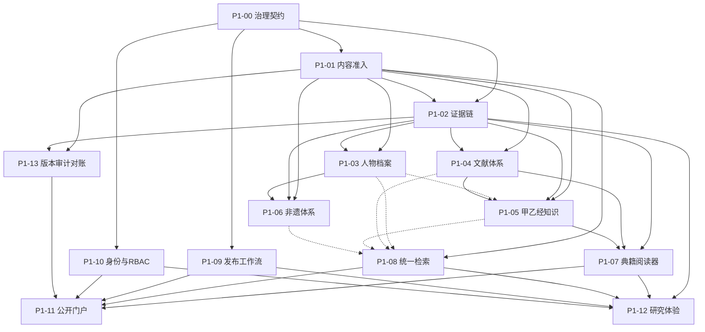

# HFM NPG-011 — Independent Phase 1 Governance Authorization Audit

**Role**: Gemini — Independent Governance / Architecture Authorization Auditor  
**Mode**: INDEPENDENT AUDIT ONLY (NO IMPLEMENTATION / NO REMEDIATION)  
**Date**: 2026-08-29  
**Branch**: `governance/next-phase-authorization`  
**Phase 0.4 Completion Baseline**: `0167b1702dac13993a5206f63752eafcc8e5387e`  
**Phase 1 Governance Candidate Baseline**: `acbaa6815df4261cee986894d4ba29c1d3845d90`  
**Entry State**: `READY_FOR_NPG_11_INDEPENDENT_AUTHORIZATION`  
**Final Audit Verdict**: `AUTHORIZED_FOR_PHASE_1_GOVERNANCE_BASELINE`

---

## 1. 审计候选基线与核心授权问题 (Audited Candidate Baseline & Core Question)

### 1.1 审计基线对象

- **Phase 0.4 完备性基线 (Parent Baseline)**: `0167b1702dac13993a5206f63752eafcc8e5387e`
- **Phase 1 治理候选基线 (Governance Candidate Baseline)**: `acbaa6815df4261cee986894d4ba29c1d3845d90`
- **治理冻结清单**: `docs/governance/HFM-PHASE1-GOVERNANCE-FREEZE-MANIFEST-v1.md`

### 1.2 核心授权裁决结论 (Core Authorization Answer)

从第一性原理出发，对 `acbaa6815df4261cee986894d4ba29c1d3845d90` 提交所包含的全部治理契约、架构边界、迁移规范、DAG 依赖图谱、验收与证据链条进行独立复核。结论如下：

该基线所定义的 Phase 1 治理契约完全满足：
1. **必要性 (Necessary)**: 14 项 IN 范围严格对应客户确认需求 (L1) 或必要派生产品需求 (L2)，无冗余膨胀。
2. **充分性 (Sufficient)**: 覆盖双层架构、四大领域（A/B/C/D）、阅读器、统一检索、发布审批、RBAC、证据与版本审计等关键业务闭环。
3. **内部一致性 (Internally Consistent)**: 需求 ↔ 范围登记 ↔ 工作包 (WP) ↔ DAG 节点 ↔ 验收标准 ↔ 证据链 ↔ DoD 达成严格 14/14 映射，全链路无孤岛。
4. **边界严格受控 (Bounded)**: 明确排除 DEFERRED 模块（3D/VR/XR/实训/AI等）与 REJECTED 临床诊断处方行为。
5. **可测试与证据可验证 (Testable & Evidence-Verifiable)**: 14 项验收标准均具化为可执行的测试方法、产物与通过条件，拒绝循环论证。
6. **就绪性基于显式 ADR 前置 (Implementation-Ready Subject to Explicit ADRs)**: 5 项前置阻塞 ADR 严格约束对应 WP 开工条件，治理授权与开工授权明确解耦。
7. **零未授权范围扩散 (Free from Unauthorized Scope Expansion)**: 无任何 L3 技术提案被强制提升为约束性需求。
8. **杜绝 HFB 运行时耦合 (Safe from HFB Runtime Coupling)**: HFB 仅作为受控迁移源，绝对禁止 HFM 运行时产生对 HFB 的数据库、API 或凭据依赖。
9. **杜绝意外生产导入 (Safe from Accidental Production Migration)**: 生产 HFB 导入维持 `NOT PERFORMED`，M4 独立治理授权与 M5 生产导入强隔离。
10. **与客户确认需求完全一致 (Consistent with Customer-Confirmed Requirements)**: 忠实继承甘肃医学院与示范中心建设目标及五大类资产边界。

---

## 2. 基线完整性独立验证 (Baseline Integrity Verification)

| 检查项 | 验证命令 / 方法 | 验证结果 | 状态 |
| --- | --- | --- | --- |
| **候选基线血统关系** | `git merge-base --is-ancestor 0167b17 acbaa68` | 返回 Exit Code 0，Candidate 完全自 Phase 0.4 父基线线性衍生 | **PASS** |
| **Phase 0.4 历史不可变性** | `git log --oneline 0167b17` 检查 | 历史提交与标签未被重写或变异 | **PASS** |
| **Delta 范围纯净度** | `git diff --name-status 0167b17..acbaa68` | 31 个新增文件全部位于 `docs/audit/**`、`docs/governance/**` 及 `docs/governance/inputs/**`；0 个 Phase 0.4 文件被修改或删除 | **PASS** |
| **工作区洁净度** | `git status --porcelain` | Output 为空，Working tree 处于完全 clean 状态 | **PASS** |
| **CD-7 绝对不存在性** | `git branch -a`, `git tag -l`, `git log --all --grep="CD-7"`, `find . -name "*CD-7*"` | 全仓库分支、标签、提交信息及文件路径均无 CD-7 实体，CD-7 **NONEXISTENT** | **PASS** |

---

## 3. 冻结清单 SHA-256 独立重算 (Freeze Manifest Verification)

独立对 `docs/governance/HFM-PHASE1-GOVERNANCE-FREEZE-MANIFEST-v1.md` 中登记的全部 18 个冻结治理产物执行逐字节 SHA-256 哈希计算与比对：

| 序号 | 治理产物路径 | 清单记录 SHA-256 | 独立重算 SHA-256 | 比对结果 |
| --- | --- | --- | --- | --- |
| 1 | `docs/governance/HFM-PHASE1-SCOPE-REGISTER-v1.md` | `281722177ac04643691f3eb241df18e1d8b00c4114873db63f35dc4d0769d73e` | `281722177ac04643691f3eb241df18e1d8b00c4114873db63f35dc4d0769d73e` | **MATCH** |
| 2 | `docs/audit/HFM-NPG-006-PHASE1-SCOPE-ARBITRATION.md` | `bdbf9283c8e178bf4aec7f8c49719ad23df561ba70da7c3af1238cac9888b13f` | `bdbf9283c8e178bf4aec7f8c49719ad23df561ba70da7c3af1238cac9888b13f` | **MATCH** |
| 3 | `docs/governance/HFM-PHASE1-ARCHITECTURE-BOUNDARY-v1.md` | `2464276e5c9ea02331674e32e53d4890e793651dfb13e4ebb06585be5f09fb0e` | `2464276e5c9ea02331674e32e53d4890e793651dfb13e4ebb06585be5f09fb0e` | **MATCH** |
| 4 | `docs/governance/HFM-PHASE1-ADR-REGISTER-v1.md` | `56faf9ad3a1a0ff39b07a22edd73e23f7640be71bf742433f29ce4479fa01b1f` | `56faf9ad3a1a0ff39b07a22edd73e23f7640be71bf742433f29ce4479fa01b1f` | **MATCH** |
| 5 | `docs/audit/HFM-NPG-007-ARCHITECTURE-BOUNDARY-AUDIT.md` | `6a6dd72502bb47c167b2b0d145b8f05e64d707e1985c680c6a43bda13c368d1e` | `6a6dd72502bb47c167b2b0d145b8f05e64d707e1985c680c6a43bda13c368d1e` | **MATCH** |
| 6 | `docs/governance/HFM-PHASE1-MIGRATION-CONTRACT-v1.md` | `ec4bcc7430d0b283bface1825cd982cb21a729158256740294e1f4aff1672dc5` | `ec4bcc7430d0b283bface1825cd982cb21a729158256740294e1f4aff1672dc5` | **MATCH** |
| 7 | `docs/governance/HFM-PHASE1-MIGRATION-OBJECT-REGISTER-v1.md` | `e73a64a0ad6ee33e1504e017632902ef806dfc98a558a1bf6c46e9d4f3b985d3` | `e73a64a0ad6ee33e1504e017632902ef806dfc98a558a1bf6c46e9d4f3b985d3` | **MATCH** |
| 8 | `docs/audit/HFM-NPG-008-MIGRATION-CONTRACT-AUDIT.md` | `2a6980fd77c64b9054ebe0ed10de70fcd1cfb140fec365fe33d5935186207715` | `2a6980fd77c64b9054ebe0ed10de70fcd1cfb140fec365fe33d5935186207715` | **MATCH** |
| 9 | `docs/governance/HFM-PHASE1-WORK-PACKAGE-INVENTORY-v1.md` | `763b102770e01aaedf611caca25f8c83ffef669179fe6a772ad6e93abea2fc1e` | `763b102770e01aaedf611caca25f8c83ffef669179fe6a772ad6e93abea2fc1e` | **MATCH** |
| 10 | `docs/governance/HFM-PHASE1-DAG-v1.md` | `970044eabafb91c67bf7218a25b46bc570cd4db41b9af4e4e1645365682ccb30` | `970044eabafb91c67bf7218a25b46bc570cd4db41b9af4e4e1645365682ccb30` | **MATCH** |
| 11 | `docs/governance/HFM-PHASE1-ACCEPTANCE-CONTRACT-v1.md` | `879072b2204b18e49ca2b14267af78255420630c015cb9a79ce5d301a7b4a042` | `879072b2204b18e49ca2b14267af78255420630c015cb9a79ce5d301a7b4a042` | **MATCH** |
| 12 | `docs/governance/HFM-PHASE1-EVIDENCE-CONTRACT-v1.md` | `2faf03f62735cf3f2b997776561e2a758e72d350447aac5992325c386b975613` | `2faf03f62735cf3f2b997776561e2a758e72d350447aac5992325c386b975613` | **MATCH** |
| 13 | `docs/governance/HFM-PHASE1-DEFINITION-OF-DONE-v1.md` | `b1a8328a63dfd325ee4c35c43b4a5fc1ab140c39eb67824c16c3f9abbeae57b2` | `b1a8328a63dfd325ee4c35c43b4a5fc1ab140c39eb67824c16c3f9abbeae57b2` | **MATCH** |
| 14 | `docs/governance/HFM-PHASE1-CONTENT-BATCH-DOD-TEMPLATE-v1.md` | `c373758cc4b93ffc30258e1ca97775fcb0488a853111d952d240f1ad72c2441e` | `c373758cc4b93ffc30258e1ca97775fcb0488a853111d952d240f1ad72c2441e` | **MATCH** |
| 15 | `docs/audit/HFM-NPG-009-DAG-ACCEPTANCE-DOD-AUDIT.md` | `4de19c630553228506620f4985d9055a8ce35049d07ed2cef373d198c9e255ad` | `4de19c630553228506620f4985d9055a8ce35049d07ed2cef373d198c9e255ad` | **MATCH** |
| 16 | `docs/governance/inputs/HFM-CLIENT-CONFIRMED-REQUIREMENTS-v1.md` | `6130a25796f1f4c88fee993d5d39b3f6c6391027f4102855d4c9cc24dc37b453` | `6130a25796f1f4c88fee993d5d39b3f6c6391027f4102855d4c9cc24dc37b453` | **MATCH** |
| 17 | `docs/governance/HFM-NPG-R1-GOVERNANCE-INPUT-MANIFEST.md` | `e346aa87a430f6cf26a61269b9a60a7987cbc6894949fb76da367c084a4c527a` | `e346aa87a430f6cf26a61269b9a60a7987cbc6894949fb76da367c084a4c527a` | **MATCH** |
| 18 | `docs/audit/HFM-NPG-BOUNDARY-REGISTER.md` | `53e9b0ea57d10101001a33a1bf783e20291bc4da63e994bc715ca30d749fc837` | `53e9b0ea57d10101001a33a1bf783e20291bc4da63e994bc715ca30d749fc837` | **MATCH** |

**验证结果**: **18/18 严格匹配**，哈希防篡改与完整性校验通过。

---

## 4. 客户需求追溯性独立审计 (Customer Requirement Traceability)

依据《客户已确认需求归档 v1》(CR-001 ~ CR-010)，对 14 项 IN 范围逐一进行第一性原理追溯核实：

```mermaid
graph TD
    CR01_02[CR-001/002 建设主体与核心用户] --> P1_GOV[P1-GOV 治理契约]
    CR03_05[CR-003/005 文化研究与五类资产] --> P1_CONTENT[P1-CONTENT 内容准入]
    CR03_05 --> P1_A[P1-A 人物档案]
    CR03_05 --> P1_B[P1-B 文献思想]
    CR03_05 --> P1_C[P1-C 甲乙经知识]
    CR06_07[CR-006/007 示范中心官方命名与边界] --> P1_D[P1-D 非遗传承]
    CR04_09[CR-004/009 参观者优先与双层架构] --> P1_PORTAL[P1-PORTAL 公开门户]
    CR02_09[CR-002/009 校内研究与双层架构] --> P1_RESEARCH[P1-RESEARCH 研究工作台]
    CR03_05 --> P1_READER[P1-READER 典籍阅读器]
    CR03_09 --> P1_SEARCH[P1-SEARCH 跨域统一检索]
    CR05_07_09[CR-005/007/009 权利准入与发布控制] --> P1_PUBLISH[P1-PUBLISH 审核发布撤回]
    CR02_09_10[CR-002/009/010 权限隔离与安全运营] --> P1_RBAC[P1-RBAC 权限体系]
    CR03_05 --> P1_EVIDENCE[P1-EVIDENCE 证据引用链]
    CR05_09 --> P1_VERSION[P1-VERSION 版本审计轨迹]
```



1. **A 人物体系 (`P1-A`)**: 追溯自 CR-003（皇甫谧文化挖掘）、CR-005（史料资产），权威等级 L1/L2。
2. **B 文献/思想体系 (`P1-B`)**: 追溯自 CR-003（成果汇聚）、CR-005（典籍版本），权威等级 L1/L2。
3. **C 《针灸甲乙经》(`P1-C`)**: 追溯自 CR-003（针灸传承）、CR-005（版本资产），严格限制为历史文献检索，权威等级 L1/L2。
4. **D 非遗体系 (`P1-D`)**: 追溯自 CR-003（传承脉络）、CR-005（非遗证书/传承人资料）、CR-006/007（示范中心官方正名），权威等级 L1/L2。
5. **Public Portal (`P1-PORTAL`)**: 追溯自 CR-004（参观者首要优先级）、CR-009（公开互联网门户），权威等级 L1/L2。
6. **Research Experience (`P1-RESEARCH`)**: 追溯自 CR-002（皇甫谧学院等核心用户）、CR-009（校内研究后台），权威等级 L1/L2。
7. **Reader (`P1-READER`)**: 派生自 CR-003、CR-005（版本定位与文本阅读必需产品交互），权威等级 L2。
8. **Search (`P1-SEARCH`)**: 派生自 CR-003、CR-009（跨域资源汇聚发现之必要能力），权威等级 L2。
9. **Publication (`P1-PUBLISH`)**: 派生自 CR-005、CR-006、CR-007、CR-009 及边界 B-06（公开内容合规与撤回管控必要能力），权威等级 L2。
10. **RBAC (`P1-RBAC`)**: 派生自 CR-002、CR-009、CR-010（双层架构安全运行与默认拒绝之必要机制），权威等级 L2。
11. **Evidence (`P1-EVIDENCE`)**: 派生自 CR-003、CR-005（学术真实性与可复现性底层基石），权威等级 L2。
12. **Versioning (`P1-VERSION`)**: 派生自 CR-005、CR-009（版本流变与修订历史审计保障），权威等级 L2。
13. **P1-GOV / P1-CONTENT**: 作为架构基座与准入控制平面，严格源自 CR-003/005/009/010。

**审查结论**: 14 项 IN 范围无一来自未经授权的 L3 技术提案，L3 提案（如 Neo4j、Elasticsearch、MinIO 等）全数被隔离至待决 ADR 评估池，追溯性审查 **PASS**。

---

## 5. 范围必要性与充分性审查 (Scope Necessity & Sufficiency)

对 14 项 IN 范围进行六要素第一性原理审查：

| Scope ID | 1. 必要性 (Phase 1 必需) | 2. 边界清晰度 | 3. 责任工作包 (Accountable WP) | 4. 验收标准绑定 | 5. 证据定义 | 6. 有限 DoD 归属 |
| --- | --- | --- | --- | --- | --- | --- |
| **P1-GOV** | 必需（治理控制面） | 明确（范围/变更管控） | `P1-00` | AC: 全映射无孤立 | E-00 审计清单 | DOD-01, DOD-02, DOD-11 |
| **P1-CONTENT** | 必需（学术数据准入） | 明确（失败即拒绝） | `P1-01` | AC: 权利/源哈希校验 | E-01 准入测试 | DOD-03, DOD-04 |
| **P1-A** | 必需（人物档案支撑） | 明确（人物生平断言） | `P1-03` | AC: 证据与发布态展示 | E-03 A 域追踪 | DOD-05 |
| **P1-B** | 必需（典籍版本体系） | 明确（版本流变与权利） | `P1-04` | AC: 版本脉络不坍缩 | E-04 版本清单 | DOD-05 |
| **P1-C** | 必需（甲乙经知识检索） | 明确（禁临床/仅文献） | `P1-05` | AC: 历史检索无处方 | E-05 负向检索测试 | DOD-05, DOD-09 |
| **P1-D** | 必需（非遗传承谱系） | 明确（官方命名与权利） | `P1-06` | AC: 官方正名与授权 | E-06 非遗权限审计 | DOD-05 |
| **P1-READER** | 必需（典籍阅读交互） | 明确（精准定位/可复现）| `P1-07` | AC: 片段定位于上下文 | E-07 阅读器重现 | DOD-06 |
| **P1-SEARCH** | 必需（双层检索能力） | 明确（权限与发布过滤） | `P1-08` | AC: 无未发布泄漏 | E-08 检索流量审计 | DOD-06 |
| **P1-PUBLISH** | 必需（公开投射管控） | 明确（发布/撤回状态机）| `P1-09` | AC: 撤回可观测/审计 | E-09 发布日志追踪 | DOD-06, DOD-09 |
| **P1-RBAC** | 必需（双层身份与权限） | 明确（默认拒绝/职责分立）| `P1-10` | AC: 鉴权与越权拦截 | E-10 安全测试追踪 | DOD-03, DOD-06, DOD-09 |
| **P1-PORTAL** | 必需（公众访问界面） | 明确（仅已发布投射） | `P1-11` | AC: 匿名无内部泄漏 | E-11 门户 HAR 抓包 | DOD-07 |
| **P1-RESEARCH** | 必需（校内研究工作台） | 明确（鉴权与数据隔离） | `P1-12` | AC: 租户与成果隔离 | E-12 双用户隔离测试 | DOD-07 |
| **P1-EVIDENCE** | 必需（学术证据链） | 明确（SourceRef-Evidence）| `P1-02` | AC: 零孤儿证据链 | E-02 证据链报告 | DOD-04, DOD-08 |
| **P1-VERSION** | 必需（版本审计与对账） | 明确（不可变历史/对账）| `P1-13` | AC: 对账 PASS 零违规 | E-13 对账哈希报告 | DOD-04, DOD-08, DOD-10 |

**审查结论**:
- IN 项数量 = 14，每项均具备唯一的 WP 归属、明确的验收条件与闭环 DoD，无任何非必要功能混入。
- 平台工程所必需的最小功能集合完备，未遗漏任何关键能力。审查 **PASS**。

---

## 6. 延期与拒绝边界独立审查 (Deferred & Rejected Boundary Review)

### 6.1 DEFERRED（延期范围）隔离审查

1. **大屏/展厅触控模式 (`P1-DISPLAY`)**: 维持 DEFERRED，无对应 positive WP，不占用 Phase 1 验收门禁。
2. **HFB 业务与界面复用 (`P1-HFB-LIBRARY`, `P1-HFB-READER`, `P1-HFB-WORKSPACE`, `P1-HFB-RBAC`)**: 维持 DEFERRED，明确 HFM 具备自主契约，不依赖 HFB 既有 UI 或 Workspace 实现。
3. **AI 研究助手 (`P1-AI`)**: 维持 DEFERRED，防止在缺乏基准评测集与拒绝契约前引入幻觉与医学风险。
4. **沉浸式与仿真教学 (`P1-3D`, `P1-VR`, `P1-XR`, `P1-TRAIN`)**: 严格遵照客户确认文件 (CR-008)，全数维持 DEFERRED。

### 6.2 REJECTED（绝对拒绝范围）红线审查

- **临床针灸处方与诊疗推荐 (`P1-CLINICAL`)**: 状态为 **REJECTED**。
- **渗透防护验证**: 审查了 `P1-C`、`P1-SEARCH`、`P1-READER` 的验收标准与负向测试用例（AC-05、E-05、DOD-09）。所有接口与检索逻辑均显式设置负向守卫，严禁输出“主穴/配穴推荐”、“治疗方义”、“处方排序”或“疗效断言”，杜绝临床推荐语义通过其他模块变相渗入。

**审查结论**: 延期与拒绝边界清晰稳固，审查 **PASS**。

---

## 7. 架构独立复核 (Architecture Independent Review)

依据 `HFM-PHASE1-ARCHITECTURE-BOUNDARY-v1.md` (AB-01 ~ AB-16) 进行复核：

1. **HFM 规范领域主权 (AB-01)**: HFM 拥有实体、典籍、版本、证据、断言、引用的唯一规范数据模型，拒绝双源真理。
2. **双层体验隔离 (AB-02, AB-05, AB-10)**: 公开门户与研究后台在数据投射、API 路由、检索索引上严格逻辑隔离。公开端仅能消费经审批发布的投射快照，研究态草稿与内部凭证绝对不可见。
3. **共享底层核心 (AB-03, AB-04)**: 内容核心与证据语义由受控核心服务统一管理，避免多套证据链实现。
4. **发布与撤回状态机 (AB-07)**: 发布状态独立于研究数据存在，撤回/回滚操作具可观测性且保留审计日志。
5. **权限与安全模型 (AB-08)**: 默认拒绝 (Deny-by-default) 与职责分立。
6. **无 HFB 运行时依赖 (AB-13)**: HFM 部署、鉴权、数据读写严禁依赖 HFB 服务、数据库或凭据。HFB 仅为迁移源。
7. **能力与填充解耦 (AB-15)**: 平台工程能力闭环与客户全量内容交付资产彻底解耦，平台通过标准验收 Fixtures 闭环。
8. **医学文献与临床边界 (AB-14)**: C 域仅提供历史文献与知识脉络检索，严禁任何形式的决策支持。

**审查结论**: 架构原则自洽，无隐式耦合，审查 **PASS**。

---

## 8. 前置阻塞 ADR 授权测试 (ADR Authorization Test)

当前注册表中的 `PRE_IMPLEMENTATION_BLOCKING` ADR 状态如下：

| ADR 编号 | 决策领域 | 影响之工作包 | 阻塞性质判定 | 治理授权与实现解耦判定 |
| --- | --- | --- | --- | --- |
| **ADR-01** | 物理部署拓扑（单体/微服务/混合） | P1-11, P1-12 | **BLOCKING** | 阻断对应工作包编码实现，不阻断治理基线冻结 |
| **ADR-02** | 检索实现技术选型（PG-FTS/ES等） | P1-08 | **BLOCKING** | 阻断 P1-08 技术落地，契约接口已由治理冻结 |
| **ADR-05** | 公开与研究 API 隔离形态 | P1-11, P1-12 | **BLOCKING** | 阻断 API Gateway / 路由实现，逻辑边界已冻结 |
| **ADR-06** | HFB 适配器/迁移技术策略 | P1-02, P1-13 | **BLOCKING** | 阻断迁移工具编写，数据映射契约已冻结 |
| **ADR-07** | 身份与 RBAC 实现策略 | P1-10 | **BLOCKING** | 阻断 Auth 服务选型，默认拒绝与角色模型已冻结 |

### 关键授权语义区别
> **治理授权 (GOVERNANCE AUTHORIZATION)** 并不等于 **全部工程立即开工 (IMPLEMENTATION COMMENCEMENT)**。  
> 治理授权确立了 ADR 的裁决标准、依赖关系与验收边界。在任何依赖于 ADR-01/02/05/06/07 的工作包启动前，对应的 ADR 必须单独形成独立决策产物并通过治理评审。DAG 契约在结构上已明确表达此前置约束。

**审查结论**: ADR 阻塞逻辑清晰，机制完备，审查 **PASS**。

---

## 9. DAG 有向无环图独立验证 (DAG Independent Validation)

通过图论算法（Kahn 算法拓扑排序与 BFS 遍历）对 `docs/governance/HFM-PHASE1-DAG-v1.md` 进行独立数学验证：



- **节点总数 (Nodes)**: 14（`P1-00` 至 `P1-13`）
- **边总数 (Edges)**: 36（31 条强阻塞边，5 条非阻塞关系边）
- **环路检测 (Cycles)**: 0（拓扑排序成功访问全部 14 个节点）
- **不可达节点 (Unreachable Nodes)**: 0（从根节点 `P1-00` 出发可达 14 个节点）
- **拓扑排序序列**: `P1-00` → `P1-01` → `P1-09` → `P1-10` → `P1-02` → `P1-03` → `P1-04` → `P1-13` → `P1-06` → `P1-05` → `P1-07` → `P1-08` → `P1-11` → `P1-12`
- **延期/拒绝特性依赖**: 0
- **HFB 运行时依赖**: 0

**审查结论**: DAG 结构严格有向无环且完全闭包，审查 **PASS**。

---

## 10. 验收标准与证据链验证 (Acceptance & Evidence Validation)

- **验收标准总数**: 14
- **证据映射总数**: 14
- **闭环验证检查**: 每一个 WP 均具有明确的 `输入 → 输出 → 前置条件 → 验收标准 → 负向标准 → 证据类型 → 验证方法 → PASS 条件` 链条。
- **杜绝循环证据**: 绝无“因审计报告写 PASS 故 PASS”的循环定义。所有验收依据均为具体产物（测试用例、网络抓包 HAR、数据库记录、哈希清单、对账报告）。

**审查结论**: 验收与证据体系完全可执行、可检验，审查 **PASS**。

---

## 11. 完成定义验证 (Definition of Done Validation)

对 `HFM-PHASE1-DEFINITION-OF-DONE-v1.md` 中的 12 项 DoD 条目进行闭环分析：

1. **DOD-01 (范围闭环)**: 14 项 IN 范围完全映射，无孤立项。
2. **DOD-02 (DAG 闭环)**: 14 节点、零环路、零悬挂。
3. **DOD-03 (架构合规)**: AB-01~16 边界合规，无 HFB 运行时依赖。
4. **DOD-04 (领域准入与证据)**: 准入与引用链无孤儿链接。
5. **DOD-05 (A/B/C/D 领域能力)**: 四大领域具备实证数据与发布态。
6. **DOD-06 (核心功能体验)**: 阅读器/检索/发布/RBAC 正负向测试全通。
7. **DOD-07 (双层隔离)**: 公开与研究端在 API 与浏览器端完全隔离。
8. **DOD-08 (证据可追溯)**: 所有 PASS 状态均绑定哈希与不可变产物。
9. **DOD-09 (负向安全防线)**: 越权、泄漏、临床处方、未经审批发布等负向用例全过。
10. **DOD-10 (迁移安全隔离)**: M0~M3 隔离准备，M4~M7 严禁提前执行，生产导入保持 `NOT PERFORMED`。
11. **DOD-11 (治理防线)**: 无延期/拒绝项混入，无 CD-7 产生。
12. **DOD-12 (集成验收交付)**: 全矩阵端到端复核，零例外项。

- **无范围溯源的 DoD 数量**: 0
- **DoD 有限性**: 均为工程与数据层面的可验证判定，不能单靠文档陈述满足。

**审查结论**: DoD 完备、严谨且有限，审查 **PASS**。

---

## 12. 内容交付就绪度测试 (Content Delivery Readiness Test)

- **当前状态判定**: `CONTENT_DELIVERY_READINESS: PARTIAL / NON-BLOCKING`
- **逻辑合理性确认**:
  - 缺失的客户内容资产（CA-01 ~ CA-05 原始文献/史料文件）仅影响特定内容批次的导入与填充，不构成底层平台工程框架与协议研发的阻塞项（平台研发依赖标准验收 Fixtures）。
  - 缺失的客户权利/授权证书（CA-06/07/10）严格阻塞对应资产的公开上架发布，杜绝无权发布风险。
  - 内容批次完工定义 (`docs/governance/HFM-PHASE1-CONTENT-BATCH-DOD-TEMPLATE-v1.md`) 提供了独立的十步门禁，平台能力验收与内容上线审批权责分明。

**审查结论**: 内容就绪度状态定义合理，解耦有效，审查 **PASS**。

---

## 13. 迁移安全测试 (Migration Safety Test)

1. **M0 ~ M7 契约执行力**:
   - M0（快照校验）、M1（映射校验）、M2（沙箱演练）、M3（对账核验）仅限于隔离环境准备。
   - **M4（生产迁移授权）**: 必须作为独立治理产物另行签署。
   - **M5（生产导入）**: **在 M4 获得 PASS 之前绝对禁止执行**。
   - 本 NPG-11 审计**绝对不包含对 M5 的授权**。
2. **生产 HFB 导入状态**: 明确维持 **`NOT PERFORMED`**。
3. **HFB 证据/引用映射**: 仅为数据层依赖映射 (`DEPENDENCY_ONLY`)，导入后数据归属于 HFM 规范模型，不产生长期运行时依赖。

**审查结论**: 迁移安全防护坚实，审查 **PASS**。

---

## 14. 负向契约测试 (Negative Contract Test)

经逐项验证，Phase 1 治理契约已建立完备的负向阻断机制：

- [x] **严禁创建 CD-7**: 历史与当前均保持 `NONEXISTENT`。
- [x] **严禁修改 Phase 0.4 历史与代码**: 父基线保持只读。
- [x] **严禁未授权范围扩张**: 排除所有 L3 提案。
- [x] **严禁未经 M4 授权执行生产导入**: M5 保持封禁。
- [x] **严禁公开端暴露未发布研究内容**: 默认隐藏草稿与私有标注。
- [x] **严禁孤儿证据/引用链条**: 准入与对账自动 fail-closed。
- [x] **严禁输出临床诊断与针灸处方建议**: 彻底拒绝 `P1-CLINICAL`。
- [x] **严禁权限提升与未授权访问**: RBAC 默认拒绝。
- [x] **严禁延期模块依赖泄漏**: 核心代码不包含 3D/VR/AI 接口。
- [x] **严禁 HFB 成为 HFM 运行时真理源**: 杜绝运行时 API 与 DB 依赖。

**审查结论**: 负向契约防线齐备，审查 **PASS**。

---

## 15. 跨契约一致性与发现分类 (Cross-Contract Consistency & Findings)

### 15.1 一致性对账矩阵

$$\text{客户需求 (L1/L2)} \equiv \text{范围登记表 (14 IN)} \equiv \text{工作包清单 (14 WP)} \equiv \text{DAG 图谱 (14 Nodes)} \equiv \text{架构边界 (AB 01-16)} \equiv \text{迁移契约 (M0-M7)} \equiv \text{验收标准 (14 AC)} \equiv \text{证据映射 (14 E)} \equiv \text{DoD (12 DOD)}$$

### 15.2 审计发现分类 (Findings Register)

- **P0 阻塞级发现 (Authorization Blockers)**: **0 个**。
- **P1 前置阻塞级发现 (Must Fix/Resolve Before Affected WP Begins)**:
  1. **前置 ADR 决策门禁**: ADR-01、ADR-02、ADR-05、ADR-06、ADR-07 必须在对应 WP 编码实现前完成独立 ADR 决策与审批。
  2. **客户内容批次交付门禁**: 生产环境上线发布必须按照 Content Batch DoD 模板完成权利与元数据准入。
- **P2 文档澄清级发现 (Non-Blocking Clarifications)**:
  1. **DAG 边数文字描述同步**: 在 `HFM-PHASE1-DEFINITION-OF-DONE-v1.md` (DOD-02) 和 `HFM-PHASE1-DAG-v1.md` (第 51 行总结文本) 中出现 “26 edges” 字样，属于前期草案文字遗留；实际表格行数、DAG 头部声明 (第 4 行)、冻结清单 (第 44 行) 与 NPG-009 报告均准确定义并计算为 36 条边（31 条强依赖边 + 5 条非阻塞关系边）。图论结构验证完全成立，此项仅属非阻塞性文字勘误，不影响治理决策效力。
  2. **ADR-03 / ADR-04 本地选型监控**: ADR-03（知识关系存储）与 ADR-04（媒体存储）当前列为 `IMPLEMENTATION_LOCAL`，若后续选型突破现有关系与存储边界，需主动升格为正式 ADR 决策。

---

## 16. 授权语义明确声明 (Authorization Semantics)

本审计所给予的授权判定仅具有如下确切含义：

### ✅ 授予的含义
- **`PHASE_1_GOVERNANCE_AUTHORIZED`**: 确认该冻结候选基线已正式成为 Phase 1 架构与治理的法定基线。
- 后续实施必须且仅能严格按照已冻结的 14 个节点 DAG 依赖图谱展开。
- 承认 PRE_IMPLEMENTATION_BLOCKING ADR 作为受影响工作包的前置准入条件。

### ❌ 绝对不代表的含义
- **绝对不代表 `PRODUCTION_HFB_IMPORT_AUTHORIZED`**（生产导入维持未执行/未授权）。
- **绝对不代表 `ALL_CONTENT_APPROVED`**（客户资产仍需逐批通过内容门禁）。
- **绝对不代表 `ALL_ADRS_RESOLVED`**（5 项阻塞 ADR 仍处于待决状态）。
- **绝对不代表 `PHASE_1_IMPLEMENTATION_COMPLETE`**（尚未开始工程实现）。
- **绝对不代表创建 CD-7**。

---

## 17. 最终授权裁决 (Final Verdict)

依据上述所有独立证据与第一性原理验证，本独立审计员作出最终裁决：

```text
================================================================================
FINAL VERDICT:
AUTHORIZED_FOR_PHASE_1_GOVERNANCE_BASELINE
================================================================================
```

### 必须永久保持的不变量声明 (Immutable Invariants Preserved)

```text
Production HFB Import:
NOT PERFORMED / NOT AUTHORIZED

CD-7:
NONEXISTENT

PRE_IMPLEMENTATION_BLOCKING ADRs:
UNRESOLVED / MUST PASS BEFORE DEPENDENT WP

Phase 1 Implementation:
NOT AUTHORIZED TO BYPASS DAG OR ADR GATES
```
