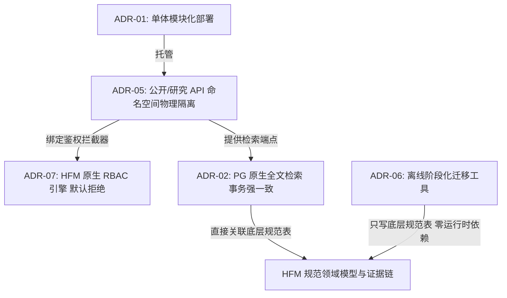

# HFM Phase 1 — Blocking ADR Resolution Audit

**Role**: Gemini — Independent Architecture Decision Auditor  
**Mode**: ARCHITECTURE DECISION ONLY (NO IMPLEMENTATION)  
**Date**: 2026-08-29  
**Formal Phase 1 Governance Baseline**: `29c5b856f221a12bac9de13e1a5043c5d05208e2`  
**Entry State**: `PHASE_1_GOVERNANCE_BASELINE_ARCHIVED`  
**Audit Target**: Resolution of 5 `PRE_IMPLEMENTATION_BLOCKING` ADRs (ADR-01, ADR-02, ADR-05, ADR-06, ADR-07)  
**Final Verdict**: `BLOCKING_ADRS_RESOLVED_READY_FOR_PHASE1_EXECUTION_AUTHORIZATION`

---

## 1. 审计背景与裁决原则 (Audit Context & Principles)

在正式 Phase 1 治理基线 `29c5b856f221a12bac9de13e1a5043c5d05208e2` 确立后，共有 5 项被标记为 `PRE_IMPLEMENTATION_BLOCKING` 的架构决策（ADRs）阻断了相关工作包的编码实现。

本独立审计严格遵循以下决策准则：
1. **最简充分原则 (Occam's Razor & Minimum Sufficiency)**: 严格选择“满足 Phase 1 必要条件的最简单架构”。
2. **拒绝假设性扩张**: 绝不因为历史提案（如 Gemini 早期设想）提及某项技术而盲目采用；绝不引入未经必要性证明的基础设施（如 Elasticsearch 集群、独立微服务架构、Neo4j、MinIO 集群等）。
3. **真实仓库事实优先**: 基于当前 HFM 现有代码库（FastAPI + SQLAlchemy + PostgreSQL + Vue 3 + Vite）与已冻结治理边界（AB-01 ~ AB-16）作出可执行、可测试、可回滚的技术决策。

---

## 2. 5 项前置阻塞 ADR 裁决总结 (ADR Resolution Summary)

| ADR 编号 | 决策领域 | 最终决策方案 | 决策状态 | 核心理由与守卫 | 对应决策产物文件 |
| --- | --- | --- | --- | --- | --- |
| **ADR-01** | 物理部署拓扑与体验隔离 | **单体模块化部署 + 严格逻辑与鉴权隔离** (Single Deployable Modular System) | **ACCEPTED** | 1 个 Nginx + 1 个 FastAPI + 1 个 PostgreSQL；极简运维与单库事务一致性，保留未来按命名空间微服务化演进路径。 | [`docs/governance/adr/HFM-PHASE1-ADR-01-DEPLOYMENT-TOPOLOGY.md`](file:///users/likeming/sites/hfm/docs/governance/adr/HFM-PHASE1-ADR-01-DEPLOYMENT-TOPOLOGY.md) |
| **ADR-02** | 跨域统一检索实现 | **PostgreSQL 原生全文检索 (`pg_trgm` + GIN) 与多维过滤** | **ACCEPTED** | 零新增中间件，与发布/撤回状态强一致，无同步延迟；硬编码公开端发布过滤；严禁临床处方排序与推荐。 | [`docs/governance/adr/HFM-PHASE1-ADR-02-SEARCH.md`](file:///users/likeming/sites/hfm/docs/governance/adr/HFM-PHASE1-ADR-02-SEARCH.md) |
| **ADR-05** | 公开与研究 API 隔离形态 | **显式路由命名空间 + 专用 Pydantic 响应视图模型 + 仓储层强制过滤** | **ACCEPTED** | 物理划分 `/api/v1/public/*` 与 `/api/v1/research/*` 命名空间；公开端强制白名单模型，严禁泄露内部草稿与私有数据。 | [`docs/governance/adr/HFM-PHASE1-ADR-05-PUBLIC-RESEARCH-API.md`](file:///users/likeming/sites/hfm/docs/governance/adr/HFM-PHASE1-ADR-05-PUBLIC-RESEARCH-API.md) |
| **ADR-06** | HFB 适配器与迁移技术策略 | **离线独立阶段化迁移 CLI 工具链 + 失败即关闭校验 + 幂等批次对账** | **ACCEPTED** | 迁移工具独立于运行时，完全遵循 M0~M7；严格绑定快照哈希；保持生产导入为 `NOT PERFORMED`，M4 之前禁止 M5。 | [`docs/governance/adr/HFM-PHASE1-ADR-06-HFB-MIGRATION-ADAPTER.md`](file:///users/likeming/sites/hfm/docs/governance/adr/HFM-PHASE1-ADR-06-HFB-MIGRATION-ADAPTER.md) |
| **ADR-07** | 身份与 RBAC 权限策略 | **HFM 原生轻量级 5 角色 RBAC 引擎 + 可插拔机构认证接口** | **ACCEPTED** | 自主拥有用户与权限表，默认拒绝；严格区分学者提交与审核员发布（职责分立）；支持无缝扩展对接校方 CAS。 | [`docs/governance/adr/HFM-PHASE1-ADR-07-IDENTITY-RBAC.md`](file:///users/likeming/sites/hfm/docs/governance/adr/HFM-PHASE1-ADR-07-IDENTITY-RBAC.md) |

---

## 3. ADR-03 与 ADR-04 状态核查 (Local ADRs Status)

- **ADR-03 (知识关系存储)**: 经评估，Phase 1 的 A/B/C/D 四大领域知识关系完全可由 HFM 规范层现有的关系表（`Entity`, `Assertion`, `EventRelation`）配合 PostgreSQL 外键与索引高效承载，无需引入图数据库（Neo4j）。维持 **`IMPLEMENTATION_LOCAL`**。
- **ADR-04 (对象与媒体存储)**: 经评估，Phase 1 静态典籍扫描图片与非遗图片可采用本地磁盘挂载 + SHA-256 内容寻址哈希目录 + Nginx 静态加速服务承载，无需引入分布式对象存储集群（MinIO）。维持 **`IMPLEMENTATION_LOCAL`**。

两者均未转化为阻塞性决策，不扩大本次架构裁决范围。

---

## 4. 跨 ADR 一致性验证矩阵 (Cross-ADR Consistency Matrix)

对 5 项决策之间的协同性与防线闭合性进行交叉验证：



1. **部署架构与 API 隔离的一致性 (ADR-01 $\leftrightarrow$ ADR-05)**:
   - 单一 FastAPI 容器内通过 APIRouter 物理拆分 `/api/v1/public` 与 `/api/v1/research`，在保证开发运维最简的同时，实现了零歧义的接口与数据隔离。
2. **API 隔离与权限模型的一致性 (ADR-05 $\leftrightarrow$ ADR-07)**:
   - `/api/v1/public/*` 彻底免除 Token 强制校验，保障公众匿名消费体验；`/api/v1/research/*` 与 `/api/v1/admin/*` 全局注入 RBAC 依赖，践行默认拒绝。
3. **检索架构与发布状态机的一致性 (ADR-02 $\leftrightarrow$ ADR-01/05)**:
   - 基于单一 PostgreSQL 的原生全文检索避免了外挂搜索引擎（如 ES）带来的同步延迟，发布撤回（Withdrawal）可实现毫秒级事务强一致生效，彻底杜绝已撤回文献在搜索结果中的残留泄漏。
4. **迁移隔离与规范主权的一致性 (ADR-06 $\leftrightarrow$ 架构整体)**:
   - 迁移工具完全离线化，运行时零 HFB 代码导入，零 HFB 数据库外键，严格遵守 M0~M7 门禁，有力捍卫了 HFM 规范领域的唯一真理源。
5. **医学安全防线一致性 (ADR-02, ADR-05 $\leftrightarrow$ AB-14)**:
   - 检索与 API 接口坚决剔除任何处方推荐算法，仅输出客观历史文献定位与引文。

**跨 ADR 一致性核查结果**: **PASS (100% 闭环自洽)**。

---

## 5. DAG 依赖解锁与工程准入状态 (DAG Impact & Execution Eligibility)

随着 5 项 `PRE_IMPLEMENTATION_BLOCKING` ADR 全部获得正式批准（`ACCEPTED`），Phase 1 DAG 中的所有架构阻塞点已全部消除。

根据已冻结的 DAG 拓扑排序序列：
$$\text{P1-00} \rightarrow \text{P1-01} \rightarrow \text{P1-09} \rightarrow \text{P1-10} \rightarrow \text{P1-02} \rightarrow \text{P1-03} \rightarrow \text{P1-04} \rightarrow \text{P1-13} \rightarrow \text{P1-06} \rightarrow \text{P1-05} \rightarrow \text{P1-07} \rightarrow \text{P1-08} \rightarrow \text{P1-11} \rightarrow \text{P1-12}$$

### 最早具备开工条件的工作包集合 (Earliest Eligible Work Packages)
1. **`P1-00` (Phase 1 治理契约与变更控制)**: 根节点，已完全具备条件。
2. **`P1-01` (规范内容准入与核心契约)**: 前置 ADR-01/05 已解决，具备开工条件。
3. **`P1-10` (身份与 RBAC 权限引擎)**: 前置 ADR-07 已解决，具备开工条件。
4. **`P1-02` (证据/引用/溯源链条)**: 前置 ADR-06 适配策略已解决，可在 P1-01 完成后无缝承接。

---

## 6. 不变量与安全状态保留声明 (Immutable Invariants Preserved)

本决策审计确认以下关键治理状态继续保持绝对有效：

```text
================================================================================
CRITICAL GOVERNANCE INVARIANTS:
1. Production HFB Import:
   NOT PERFORMED / NOT AUTHORIZED (M4 未授权，M5 严禁执行)

2. CD-7:
   NONEXISTENT (绝对不存在)

3. Phase 1 Implementation Execution:
   READY FOR EXECUTION AUTHORIZATION (待正式授权后按 DAG 执行)

4. Scope Boundaries:
   DEFERRED (3D/VR/XR/实训/AI) & REJECTED (临床诊断处方) 严格排除
================================================================================
```

---

## 7. 最终审计裁决 (Final Verdict)

```text
================================================================================
FINAL VERDICT:
BLOCKING_ADRS_RESOLVED_READY_FOR_PHASE1_EXECUTION_AUTHORIZATION
================================================================================
```
