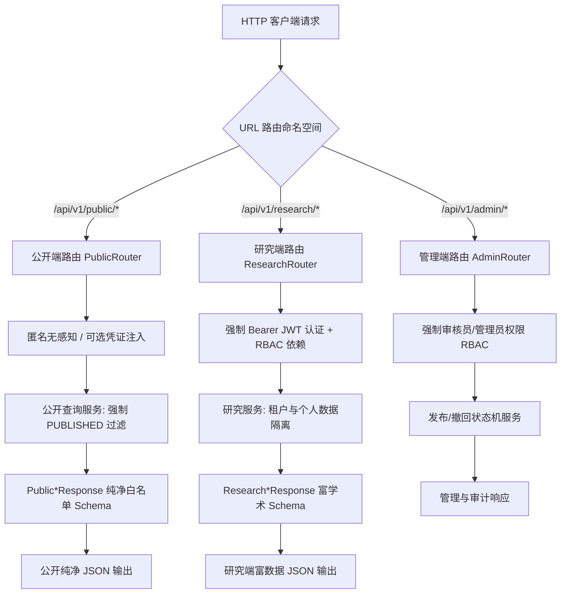

# HFM Phase 1 ADR-05 — Public / Research API Separation Architecture

- **ADR-ID**: ADR-05
- **Title**: Public / Research API Namespace, View-Model and Authorization Separation Architecture
- **Status**: `ACCEPTED`
- **Date**: 2026-08-29
- **Governance Baseline**: `29c5b856f221a12bac9de13e1a5043c5d05208e2`
- **Classification**: `PRE_IMPLEMENTATION_BLOCKING` $\rightarrow$ `RESOLVED`
- **Affected Work Packages**: `P1-09` (Publication Workflow), `P1-10` (RBAC), `P1-11` (Public Portal), `P1-12` (Research Experience)

---

## 1. Context (背景)

客户确认需求 (CR-004, CR-009) 与架构边界 (AB-02, AB-05, AB-07, AB-08, AB-10) 严格确立了双层体验分离：
1. **公开门户 (Public Portal)**: 面向公众、参观者与普通学生，无门槛匿名访问，仅消费经审核批准发布的投射数据 (`publication_status = 'PUBLISHED'`)。严禁暴露任何草稿、未审核学术断言、内部研究笔记、未授权档案或研究员私有隐私。
2. **校内研究工作台 (Research Experience)**: 面向皇甫谧学院及示范中心认证学者与学生，基于 RBAC 进行细粒度权限控制，允许访问私有研究项目、个人批注、学术证据溯源以及处于编校阶段的典籍版本。
3. **管理与发布工作流 (Publication & Admin)**: 专供内容审核员与管理员操作，包含内容准入审批、发布、紧急撤回 (Withdrawal) 与版本回滚。

必须在 API 设计与代码组织层面建立一套**零歧义、防泄漏、不可混淆**的物理级路由与序列化边界，杜绝任何因代码复用或配置错误导致的研究态数据向公众端泄漏。

---

## 2. Evidence (现有事实与证据)

1. **现有架构现状 (NPG-003 CAP-005)**: 当前 HFM 仅存在系统探测接口 (`/health`, `/system`)，未挂载任何业务路由。
2. **FastAPI 原生能力**: FastAPI 提供强大的 `APIRouter` 路由组装机制、路由级依赖注入 (`dependencies=[Depends(...)]`) 与强制响应模式校验 (`response_model=...`)，天然支持按命名空间实施强隔离。
3. **Pydantic 视图模型能力**: Pydantic v2 支持严格的字段白名单过滤 (`from_attributes=True`)，可确保序列化响应只输出显式声明的字段，自动丢弃敏感内部字段。

---

## 3. Options Considered (备选方案评估)

| 方案 | 路由设计 | 序列化模型 | 鉴权机制 | 泄漏风险 | 综合评价 |
| --- | --- | --- | --- | --- | --- |
| **Option A: 动态单一路由共享 (Shared API + Parameter Toggle)** | 统一采用 `/api/v1/works` 等路由，通过查询参数 `?view=public` 或 `?view=research` 切换逻辑。 | 共享同一套 Response Model，动态隐藏部分字段。 | 在单个 Handler 内部 `if user: ... else: ...` | **极高**（极易因条件判断失误导致私有数据泄漏） | **绝对禁止**，严重违背 AB-02 架构边界 |
| **Option B: 显式独立路由命名空间 + 独立 Pydantic 视图模型 (选定)** | 物理划分为三个顶级路由命名空间： 1. `/api/v1/public/*` 2. `/api/v1/research/*` 3. `/api/v1/admin/*` | 公开端与研究端采用完全独立的 Pydantic Response Schema。 | 路由组级别全局绑定鉴权依赖，公开端无依赖，研究端强制依赖。 | **最低**（结构性防泄漏，编译与测试期即可捕获） | **最简充分，安全可靠，推荐采用** |
| **Option C: 独立子域名与独立网关服务 (Gateway Path Routing)** | 部署独立微网关，通过 `api.public.domain` 与 `api.research.domain` 物理分流。 | 独立服务与独立数据模型。 | 网关层强制拦截。 | 低 | 增加了网关与多域名证书维护复杂度，Phase 1 暂无必要 |

---

## 4. Decision (决策内容)

**决定采用 Option B：显式独立路由命名空间 + 专用 Pydantic 视图模型白名单 + 路由级强制依赖注入策略。**

### 4.1 路由命名空间规范 (Route Namespaces)

1. **公开命名空间 (`/api/v1/public/`)**:
   - 挂载模块: `hfm.api.v1.public.*` (涵盖 `works`, `editions`, `passages`, `persons`, `heritage`, `search`)。
   - 鉴权策略: **无强制拦截**，支持公众匿名只读访问。
   - 业务逻辑: 只调用只读查询服务，底层 DAO 强制注入 `WHERE publication_status = 'PUBLISHED'`。
2. **研究工作台命名空间 (`/api/v1/research/`)**:
   - 挂载模块: `hfm.api.v1.research.*` (涵盖 `projects`, `notes`, `reader`, `citations`, `search`)。
   - 鉴权策略: 路由级全局绑定 `dependencies=[Depends(require_authenticated_user)]`。
   - 业务逻辑: 严格校验项目与笔记的数据归属 (`owner_id = current_user.id`)，杜绝越权。
3. **管理与发布命名空间 (`/api/v1/admin/` & `/api/v1/publication/`)**:
   - 挂载模块: `hfm.api.v1.admin.*` 与 `hfm.api.v1.publication.*`。
   - 鉴权策略: 路由级绑定 `dependencies=[Depends(require_permission("content:publish"))]` 等。

### 4.2 视图模型隔离规范 (View-Model Separation)

- **绝对禁止直接暴露 ORM 实体**: 所有 API 路由处理函数必须声明 `response_model`。
- **公开响应模型 (`Public*Response`)**: 仅包含对外公布的标准文字、已确认年代、官方名称与公开图片 URL。**严格排除** `draft_content`, `reviewer_notes`, `uploader_id`, `internal_hash`, `raw_file_storage_path` 等内部字段。
- **研究响应模型 (`Research*Response`)**: 包含学术证据链 (`evidence_chain`)、未决断言 (`assertions`)、版本校勘细节 (`collation_diff`) 与个人工作区关联信息。

---

## 5. Rationale (决策理由)

1. **结构性防泄漏 (Security by Design)**: 将公开与私有逻辑在路由定义和数据结构层彻底切开。即便开发者在公开接口写错 SQL，Pydantic 的 `Public*Response` 也会自动过滤掉未声明的敏感私有字段，形成双重防线。
2. **清晰的前端对接体验**: 前端公开门户只需对接 `/api/v1/public`，无需携带或维护复杂的 Token 逻辑；研究工作台统一对接 `/api/v1/research`，Axios 拦截器统一挂载 Token。
3. **零业务真理复制**: 底层数据库表与核心数据模型（`Work`, `Passage`, `Person` 等）完全统一由 HFM 规范层管理，仅在 Service 查询层与 API 视图层区分投射，既保证了数据一致性，又保证了展示安全性。

---

## 6. Consequences (决策影响)

### 正向影响 (Positive)
- 彻底杜绝草稿、私有笔记与未授权史料向公众互联网泄漏的风险。
- API 职责清晰，便于自动化安全渗透扫描与 HAR 抓包审计（E-11, E-12）。
- 易于实施针对公开接口的高并发 CDN/Nginx 缓存，以及针对研究接口的安全风控。

### 负向影响与权衡 (Trade-offs & Mitigations)
- 需要维护两套 Pydantic 响应 Schema（`Public*Response` 与 `Research*Response`）。
  - *缓解措施*: 通过继承基础 Schema（如 `BaseWorkResponse`）复用公共字段，公开端模型仅继承公开字段，研究端模型扩展内部字段。

---

## 7. Required Guards (必须执行的架构守卫)

1. **Guard-01 (静态 Lint/Type 守卫)**: 严禁在 `hfm.api.v1.public` 代码中导入 `require_authenticated_user` 以外的任何私有用户上下文；严禁公开路由使用非 `Public*` 前缀的响应模型。
2. **Guard-02 (发布状态硬约束)**: 所有公开查询底层方法必须具备单元测试，验证其 SQL 生成包含 `publication_status = 'PUBLISHED'`。
3. **Guard-03 (撤回即时阻断)**: 撤回接口 (`/api/v1/publication/withdraw`) 成功执行后，公开端再次请求对应资源必须立即返回 404 Not Found。

---

## 8. Acceptance Tests (验收测试矩阵)

| 测试用例 ID | 测试目标 | 验证方法 | 预期结果 |
| --- | --- | --- | --- |
| `TEST-ADR05-01` | 公开接口免密访问 | 匿名 GET `/api/v1/public/persons/{id}` | 返回 200 OK，仅包含公开生平与官方正名 |
| `TEST-ADR05-02` | 私有字段泄露防护 | 检查公开接口返回的 JSON 键集合 | 严禁包含 `created_by_user_id`, `internal_review_state`, `private_notes` |
| `TEST-ADR05-03` | 研究接口未鉴权拦截 | 匿名 GET `/api/v1/research/projects` | 严格返回 401 Unauthorized |
| `TEST-ADR05-04` | 跨用户数据越权拦截 (IDOR) | 用户 A 携带合法 Token 请求用户 B 的私有研究项目 | 严格返回 403 Forbidden 或 404 Not Found |

---

## 9. Reversal & Escalation Conditions (反转与升格条件)

出现以下情况时，可评估将 Public API 与 Research API 升级为独立进程部署：
1. 公开端与研究端产生完全不兼容的协议需求（如公开端采用 GraphQL/边缘计算，而研究端采用 gRPC/长连接）。
2. 安全合规审计强制要求公开端接口服务与研究后台服务采用物理隔离的双私有子网。

---

## 10. Affected Work Packages (受影响工作包)

- **P1-09**: 发布与撤回工作流。
- **P1-10**: 身份与 RBAC 权限体系。
- **P1-11**: 公开门户。
- **P1-12**: 研究工作台。
