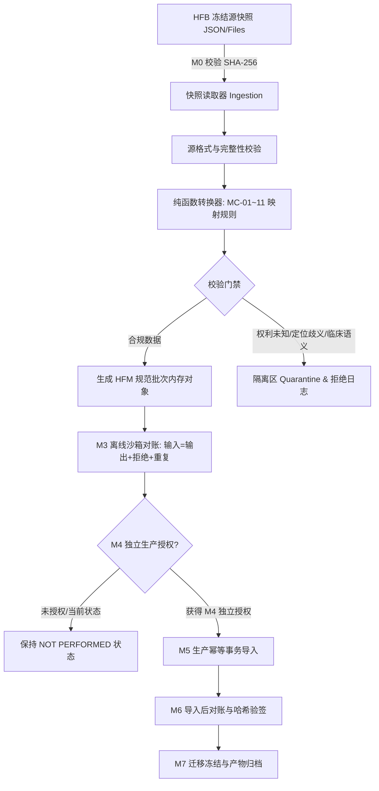

# HFM Phase 1 ADR-06 — HFB Migration Adapter Architecture

- **ADR-ID**: ADR-06
- **Title**: Offline Staged Migration Adapter Pipeline with Fail-Closed Validation and Idempotent Batch Reconciliation
- **Status**: `ACCEPTED`
- **Date**: 2026-08-29
- **Governance Baseline**: `29c5b856f221a12bac9de13e1a5043c5d05208e2`
- **Classification**: `PRE_IMPLEMENTATION_BLOCKING` $\rightarrow$ `RESOLVED`
- **Affected Work Packages**: `P1-01` (Content Admission), `P1-02` (Evidence Chain), `P1-13` (Version & Reconciliation Closure)

---

## 1. Context (背景)

根据《Phase 1 范围登记表》(Scope Register v1)、《架构边界》(AB-12, AB-13, AB-15) 与《迁移契约》(Migration Contract v1)，HFB 仅作为历史资产沉淀与学术证据映射的数据源（`DEPENDENCY_ONLY`），**绝对禁止将 HFB 演化为 HFM 的长期运行时依赖**。

数据进入 HFM 的核心约束与生命周期门禁 (M0–M7)：
1. **源快照严格绑定 (M0)**: 严格锁定 HFB Git 快照 `03755b57ec0e4c8023d1447619f7d6ead9e44d73`。
2. **生命周期门禁隔离**: M0~M3 为离线沙箱准备阶段；**M4（生产迁移授权）为必须单独签署的独立治理产物；M5（生产导入）在 M4 未获批准前绝对禁止执行**。
3. **规范模型唯一主权 (AB-01, AB-12)**: HFM 拥有规范领域的实体、证据、版本与断言模型。HFB 旧数据必须经过显式类型转换 (`TRANSFORM`) 映射进入 HFM，HFB 旧 ID 仅允许作为外部溯源元数据保留，严禁直接作为 HFM 规范主键。
4. **失败即关闭 (Fail-Closed) 与隔离区 (Quarantine)**: 凡遇到权利未知、OCR 未验、片段定位歧义、哈希不匹配或包含违规临床处方语义的记录，必须自动拒绝或隔离，严禁静默强制转换。

---

## 2. Evidence (现有事实与证据)

1. **Phase 0.4 演练事实 (NPG-000, NPG-003)**: Phase 0.4 通过 `scripts/core_completion/dry_run.py` 成功验证了在隔离内存/临时环境中对 96 条核心数据进行纯函数式转换与对账，生产数据库触碰为 `False`，证明了离线沙箱转换技术路线的可行性。
2. **对象分类事实 (Migration Object Register v1)**:
   - `MC-01 ~ MC-08, MC-10, MC-11`: 归类为 `TRANSFORM`（受控结构转换）。
   - `MC-09` (阅读器组件): 归类为 `REFERENCE_ONLY`（代码仅供参考，不迁移运行时结构）。
   - `MC-12` (用户、密码哈希、会话): 归类为 `DO_NOT_MIGRATE`（严禁迁移用户凭证）。

---

## 3. Options Considered (备选方案评估)

| 方案 | 架构模式 | 运行时依赖 | 故障隔离性 | 幂等与可逆性 | 综合评价 |
| --- | --- | --- | --- | --- | --- |
| **Option A: 线上实时双写与 DB 直连同步 (Live DB-to-DB ETL)** | HFM 后端启动时直连 HFB 数据库进行数据同步。 | **严重违规**（引入 HFB DB/网络运行时强依赖） | 差（HFB 故障直接拖垮 HFM 启动） | 差（易产生脏数据覆盖） | **绝对禁止**，彻底违反 AB-13 架构边界 |
| **Option B: 离线独立阶段化迁移 CLI 工具链 (Offline Staged Migration Pipeline - 选定)** | 独立编写离线迁移工具 (`scripts/migration/` 或 `hfm.migration`)，读取只读快照文件，经纯函数转换与校验后生成待审批批次，经 M4 授权后以幂等事务执行。 | **零运行时依赖**（运行时完全无 HFB 模块与网络调用） | **极佳**（沙箱隔离演练，对账失败自动熔断） | **极佳**（基于批次元数据与幂等键，支持完整回滚） | **完全符合 M0–M7 规范与最简原则** |
| **Option C: 手工 SQL 导入脚本 (Ad-hoc SQL Scripts)** | 人工编写 SQL 转换与插入脚本。 | 无 | 差（缺乏结构化校验与对账逻辑） | 极差（难以审计与自动化回滚） | 无法满足学术证据与审计合规要求 |

---

## 4. Decision (决策内容)

**决定采用 Option B：离线独立阶段化迁移适配器工具链架构。**



### 4.1 适配器物理位置与代码解耦 (Adapter Location & Separation)

- **工具链路径**: 全部迁移适配器代码位于 `scripts/migration/` 或 `apps/backend/src/hfm/migration/` 独立子包中。
- **依赖隔离**: 运行时核心启动文件 (`hfm.main:app`) **严禁导入任何迁移模块**。
- **数据库隔离**: HFM 数据库中严禁存在任何指向 HFB 的物理外键约束。外部关联统一使用 `external_provenance_id VARCHAR` 与 `external_source_system = 'HFB'` 字段存储。

### 4.2 批次清单与幂等性保证 (Batch Manifest & Idempotency)

每个迁移批次必须生成符合规范的结构化元数据：
```text
BATCH-ID: HFM-MIG-YYYYMMDD-01
SOURCE-SNAPSHOT: 03755b57ec0e4c8023d1447619f7d6ead9e44d73
MAPPING-CONTRACT-VERSION: v1.0.0
INPUT-COUNT: N
OUTPUT-COUNT: M
REJECTED-COUNT: R
DUPLICATE-COUNT: D
RECONCILIATION-RESULT: PASS | FAIL
```
- **幂等键定义**: `(SOURCE-SNAPSHOT, MAPPING-CONTRACT-VERSION, legacy_source_id, hfm_canonical_id)`。
- 重复重放相同批次绝不产生重复业务实体或静默修改已审核数据。

### 4.3 隔离区与回滚机制 (Quarantine & Rollback)

- 对未能通过校验的数据记录，适配器自动将其写入 `quarantine_records` 日志表，并附带明确的拒绝代码（如 `ERR_ORPHAN_LOCATOR`, `ERR_UNLICENSED_MEDIA`, `ERR_CLINICAL_SEMANTICS`）。
- 每个批次的操作全部包裹在可撤销的数据库事务中。若 M3/M6 对账出现任何违规孤儿链接或数量不守恒，整个批次自动整体回滚。

### 4.4 适配器退役机制 (Retirement Policy)

在完成最终数据迁移并通过 M7 迁移冻结归档后，该适配器工具链转入归档只读状态，作为离线对账证据保存，不再参与任何日常业务运营。

---

## 5. Rationale (决策理由)

1. **彻底消除运行时脆弱性 (AB-13)**: HFM 系统的可用性、升级与运维完全不受 HFB 历史系统状态的影响。
2. **严格守卫学术证据链完整性 (AB-04, P1-02)**: 保证进入 HFM 的每一条引文与断言都有确凿的 `SourceRef` 和 `Passage` 定位支撑，零孤儿证据。
3. **符合 M0–M7 治理严密性**: 在技术上通过独立工具链与事务回滚机制，严格保证在未取得独立 M4 授权前，无法触发生产环境数据写入。

---

## 6. Consequences (决策影响)

### 正向影响 (Positive)
- 架构纯净，HFM 拥有百分之百的领域主权。
- 迁移过程完全透明、可重现、可审计、可对账。
- 开发人员可随时在本地沙箱中重放迁移测试，极大地加速数据映射规则的验证与迭代。

### 负向影响与权衡 (Trade-offs & Mitigations)
- 编写严格的转换器与校验规则需要一定的前期开发工作量。
  - *缓解措施*: 复用 Phase 0.4 已验证的 `dry_run.py` 核心校验框架，按 MC-01~11 对象逐项实现转换器。

---

## 7. Required Guards (必须执行的架构守卫)

1. **Guard-01 (M5 生产导入绝对前置门禁)**: 迁移执行入口必须包含环境变量与签名文件校验，**在缺少经治理审计批准的 M4 授权文件前，强制拒绝执行生产写入并抛出 `MigrationAuthorizationRequiredError`**。
2. **Guard-02 (用户凭证绝对禁止导入)**: 迁移工具代码中严禁编写任何针对 `MC-12` (User/Password/Session) 的目标写入逻辑。
3. **Guard-03 (零运行时导入检查)**: CI 自动化静态分析必须检查 `hfm.main` 及所有生产 API 路由模块，严禁出现 `import hfm.migration`。

---

## 8. Acceptance Tests (验收测试矩阵)

| 测试用例 ID | 测试目标 | 验证方法 | 预期结果 |
| --- | --- | --- | --- |
| `TEST-ADR06-01` | M2 离线沙箱转换完整性 | 运行迁移工具针对测试快照执行 Dry-run | 生成完整的转换对象与对账清单，退出码为 0 |
| `TEST-ADR06-02` | M4 缺失时 M5 导入硬拦截 | 未提供 M4 授权文件直接调用生产导入命令 | 立即终止并抛出异常，生产数据库 0 写入 |
| `TEST-ADR06-03` | 孤儿证据与定位失效拦截 | 故意输入包含不存在段落引用的 HFB 脏数据 | 记录自动进入隔离区，对账报告标记拒绝原因 |
| `TEST-ADR06-04` | 幂等性重放验证 | 对同一测试库连续执行两次相同批次的导入操作 | 第二次执行时新增记录数为 0，不产生重复主键 |

---

## 9. Reversal & Escalation Conditions (反转与升格条件)

出现以下情况时，可评估调整迁移映射契约：
1. 客户正式移交了全新数字化格式的原生《针灸甲乙经》高精度古籍扫描件与结构化校勘数据（可直接走原生 Content Batch 准入，跳过 HFB 历史数据转换）。

---

## 10. Affected Work Packages (受影响工作包)

- **P1-01**: 内容准入规范。
- **P1-02**: 学术证据与引用链构建。
- **P1-13**: 版本审计与迁移对账闭环。
