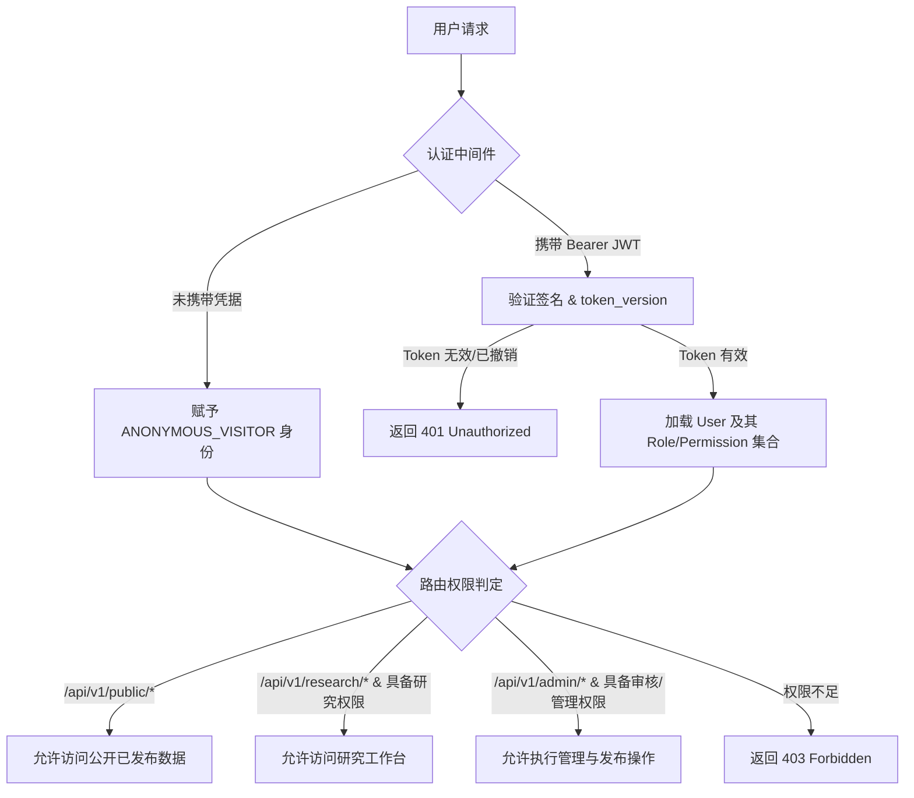

# HFM Phase 1 ADR-07 — Identity & RBAC Architecture

- **ADR-ID**: ADR-07
- **Title**: HFM-Native Lightweight RBAC Engine with Pluggable Institutional Authentication Strategy
- **Status**: `ACCEPTED`
- **Date**: 2026-08-29
- **Governance Baseline**: `29c5b856f221a12bac9de13e1a5043c5d05208e2`
- **Classification**: `PRE_IMPLEMENTATION_BLOCKING` $\rightarrow$ `RESOLVED`
- **Affected Work Packages**: `P1-00` (Governance), `P1-09` (Publication Workflow), `P1-10` (Identity & RBAC), `P1-11` (Public Portal), `P1-12` (Research Experience)

---

## 1. Context (背景)

根据客户确认需求 (CR-002, CR-004, CR-009) 与架构边界契约 (AB-08)，平台必须建立一套清晰、可信且符合校内机构运营特性的身份与权限控制体系：
1. **公众访客第一优先级 (CR-004)**: 公开门户必须支持完全免登录的匿名只读消费，严禁设置强制登录门槛。
2. **校内机构用户支撑 (CR-002)**: 支撑甘肃医学院（皇甫谧学院）师生与示范中心研究人员的学术研读、项目管理与校勘研究。
3. **默认拒绝与职责分立 (AB-08)**: 严格贯彻最小权限（Least Privilege）与默认拒绝（Deny-by-default）原则，研究人员创建的断言与内容必须由独立的内容审核员审批后方可对外发布，严禁自审自发。
4. **历史凭证禁止迁移契约 (NPG-8 MC-12)**: HFB 历史系统中的用户账号、密码哈希、会话及旧角色模型已明确列为 `DO_NOT_MIGRATE`，不得直接移植。

---

## 2. Evidence (现有事实与证据)

1. **代码库现状 (NPG-003 CAP-006/007)**: 当前 HFM 数据库中仅包含领域模型，认证与权限体系完全处于 `ABSENT` 状态，拥有完全自主设计 HFM 规范权限模型的绿地空间。
2. **HFB 经验与教训 (NPG-004 HFB-008/009)**: HFB 历史实现的 8 角色模型与旧版科研工作流强耦合，且未区分“公众匿名端”与“校内研究端”。
3. **客户机构事实 (CR-001, CR-002)**: 客户主体为高校（甘肃医学院）与地方示范中心，初期需要支持本地账号体系，并在远期具备对接高校统一身份认证（CAS/OAuth2）的扩展能力。

---

## 3. Options Considered (备选方案评估)

| 方案 | 身份源归属 | 凭据管理 | 职责分立支持 | 机构扩展性 | 综合评价 |
| --- | --- | --- | --- | --- | --- |
| **Option A: 直接移植 HFB 历史用户库与鉴权代码** | 强绑定 HFB 历史表结构与 8 角色模型。 | 继承旧哈希与会话。 | 较弱（未清晰分离发布审批）。 | 差（与 HFB 历史代码强耦合）。 | **绝对禁止**（违背 NPG-8 MC-12 契约与 AB-13 边界） |
| **Option B: 纯外部统一身份认证 (Exclusively External CAS/IdP)** | 完全依赖甘肃医学院统一身份认证服务，HFM 不设本地用户表。 | 外部管理。 | 依赖外部属性传递。 | 强。 | **不可行**（校方 IdP 接口与协议当前未移交，且无法支撑示范中心外部专家账号） |
| **Option C: HFM 原生轻量级 RBAC 引擎 + 可插拔机构认证接口 (选定)** | HFM 自主拥有规范的用户、角色、权限关系表，内置标准密码与 JWT 鉴权，同时抽象 `AuthProvider` 接口支持后续无缝对接校方 CAS/OAuth2。 | 本地安全加盐哈希 (Argon2id/bcrypt) + 无状态 JWT。 | **极佳**（精简 5 角色模型，严格职责分立）。 | **极佳**（支持本地用户与未来第三方认证并存）。 | **最简充分、安全可控、扩展性完备** |

---

## 4. Decision (决策内容)

**决定采用 Option C：构建 HFM 原生轻量级、默认拒绝的 RBAC 权限引擎，并预留可插拔机构认证接口。**



### 4.1 核心角色模型与权限矩阵 (5-Role Minimal Matrix)

| 角色代码 | 角色名称 | 适用群体 | 核心权限范围 | 发布与管理权限 |
| --- | --- | --- | --- | --- |
| `ANONYMOUS_VISITOR` | 公众访客 | 社会公众、参观者、普通浏览者 | 仅限读取公开已发布典籍、人物档案、非遗信息与公开检索。 | 零写入/零管理权限 |
| `STUDENT_RESEARCHER` | 学生研究员 | 皇甫谧学院在校学生 | 可查阅完整典籍与学术证据链，创建个人研读笔记与书签。 | 仅限个人工作区数据 |
| `SCHOLAR_RESEARCHER` | 学者研究员 | 学院教师、示范中心专家 | 可创建学术研究项目，提交典籍校勘断言提案与引文标注。 | **无最终发布权**（仅可提交待审） |
| `CONTENT_REVIEWER` | 内容审核员 | 示范中心与学院审核专家 | 审核典籍准入、审查学术断言合规性、执行**发布审批、紧急下架撤回与版本回滚**。 | **拥有发布审批与撤回权** |
| `SYSTEM_ADMIN` | 系统管理员 | 平台运维与技术主管 | 用户账号生命周期管理、角色分配、系统健康监控、审计日志查阅。 | 系统配置与安全运维 |

### 4.2 职责分立硬约束 (Separation of Duties)

- **严禁自审自发**: `SCHOLAR_RESEARCHER` 提交的学术断言和文献批次必须处于 `PENDING_REVIEW` 状态，必须由具备 `CONTENT_REVIEWER` 角色的人员审批通过后，发布状态机方可流转至 `PUBLISHED`。
- **权限判定机制**: 采用原子权限码控制（如 `assertion:create`, `content:review`, `content:publish`, `content:withdraw`, `user:manage`），API 路由通过 `Depends(require_permission("content:publish"))` 进行强制拦截。

### 4.3 凭证与会话安全策略 (Credential & Token Security)

1. **密码安全**: 采用行业标准加盐哈希算法（`bcrypt` 或 `Argon2id`），绝对禁止明文或弱加密存储。
2. **会话机制**: 采用无状态签名 JWT Bearer Token，Payload 包含 `sub (user_id)`, `role`, `token_version`, `exp`。
3. **即时撤销支持**: 在 `users` 表维护 `token_version` 整数。当发生密码重置、权限变更或主动登出时递增该版本号，中间件验证时对比版本号，实现无状态 JWT 的秒级即时失效。

### 4.4 可插拔机构认证接口 (Pluggable Auth Interface)

定义统一认证接口抽象：
```python
class BaseAuthProvider(ABC):
    @abstractmethod
    async def authenticate(self, credentials: AuthCredentials) -> UserPrincipal:
        ...
```
- Phase 1 默认启用 `LocalDatabaseAuthProvider`（基于本地用户表）。
- 后续若甘肃医学院提供 CAS/OAuth2 接入规范，只需实现 `GansuMedCASAuthProvider` 并注册至认证服务，无需改动任何下游 RBAC 权限校验逻辑。

---

## 5. Rationale (决策理由)

1. **彻底摆脱历史包袱 (NPG-8)**: 坚决不迁移 HFB 不安全的旧密码和不适配的角色模型，确保 HFM 身份系统在第一天就具备高安全性与规范性。
2. **精准匹配客户组织结构**: 5 角色模型完美覆盖高校教学、专家科研与示范中心内容审核的实际分工，简单易懂且无冗余角色。
3. **默认拒绝保障数据安全 (AB-08)**: 任何新增路由若未显式配置公开访问，均被默认拦截，杜绝由于开发遗漏导致的安全漏洞。

---

## 6. Consequences (决策影响)

### 正向影响 (Positive)
- 权限模型极简自洽，开发人员与测试人员易于理解与验证。
- 保证公众端无障碍访问，同时严密保护校内研究资产。
- 架构前瞻性良好，未来对接校方统一认证中心无阻碍。

### 负向影响与权衡 (Trade-offs & Mitigations)
- 需为 Phase 1 初始化内置基础管理员账号与种子数据。
  - *缓解措施*: 提供标准的数据库初始化 Seed 脚本，首次部署强制引导修改默认口令。

---

## 7. Required Guards (必须执行的架构守卫)

1. **Guard-01 (默认拒绝守卫)**: 研究与管理端的所有 API 路由必须显式声明权限依赖，未声明依赖的内部路由在测试套件中将被自动化扫描报警。
2. **Guard-02 (自审自发物理阻断)**: 发布审核接口必须在业务层校验 `assert reviewer_id != creator_id`（除特批超级管理员外），杜绝单人绕过审核。
3. **Guard-03 (Token 泄露与登出失效)**: 用户登出或修改密码必须立即触发 `token_version` 递增，确保已发放的 Token 即刻失效。

---

## 8. Acceptance Tests (验收测试矩阵)

| 测试用例 ID | 测试目标 | 验证方法 | 预期结果 |
| --- | --- | --- | --- |
| `TEST-ADR07-01` | 公众匿名访问放行 | 匿名调用公开典籍检索接口 | 顺利返回 200 OK |
| `TEST-ADR07-02` | 学生角色越权拦截 | 学生账号 Token 请求发布接口 `/api/v1/publication/approve` | 严格返回 403 Forbidden |
| `TEST-ADR07-03` | 审核员发布流转合规 | 审核员账号审批学者提交的断言 | 审批成功，断言状态更新为 PUBLISHED |
| `TEST-ADR07-04` | 登出会话即时失效 | 用户调用 logout 后，使用旧 Token 再次请求私有接口 | 严格返回 401 Unauthorized |

---

## 9. Reversal & Escalation Conditions (反转与升格条件)

出现以下情况时，可评估调整身份体系：
1. 甘肃医学院明确下发统一身份认证对接技术文档与联调环境，启动 `GansuMedCASAuthProvider` 的开发与挂载。

---

## 10. Affected Work Packages (受影响工作包)

- **P1-00**: 治理契约与变更控制。
- **P1-09**: 审核发布与撤回工作流。
- **P1-10**: 身份与 RBAC 权限体系。
- **P1-11**: 公开门户。
- **P1-12**: 研究工作台。
